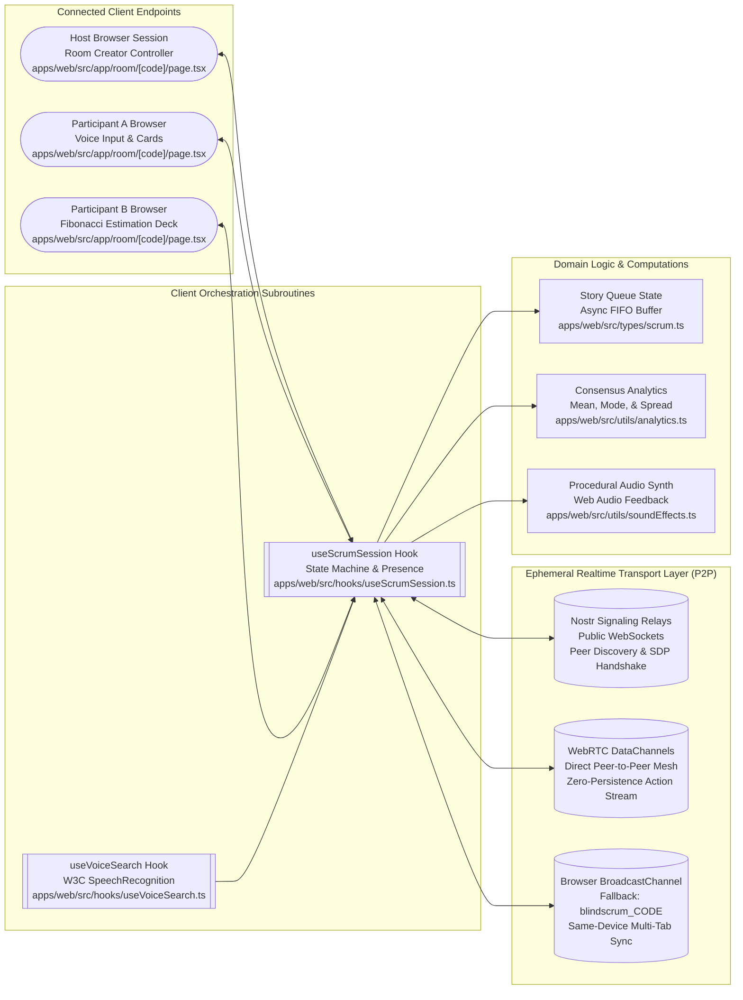
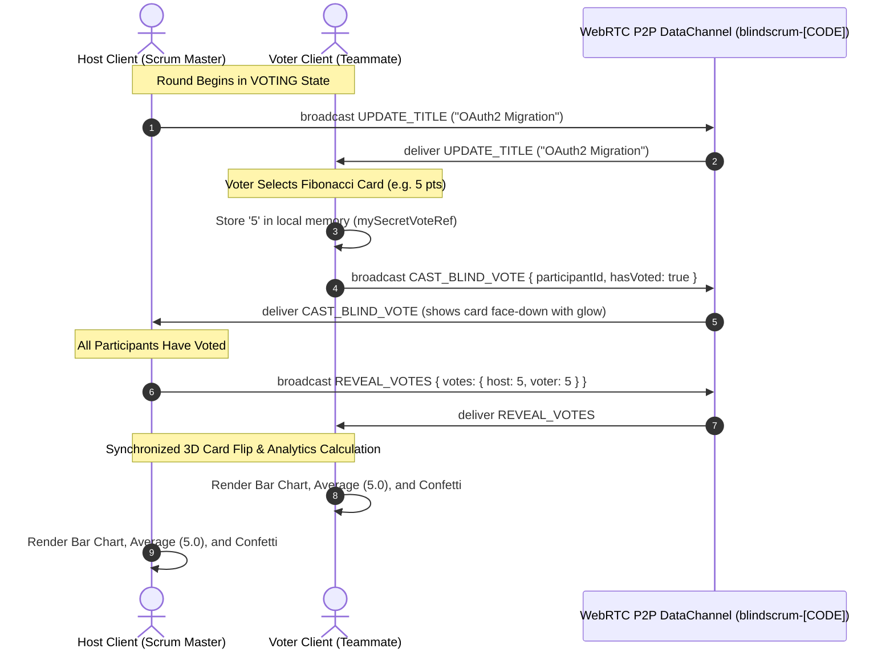
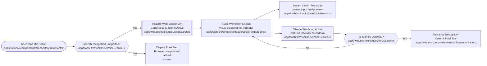
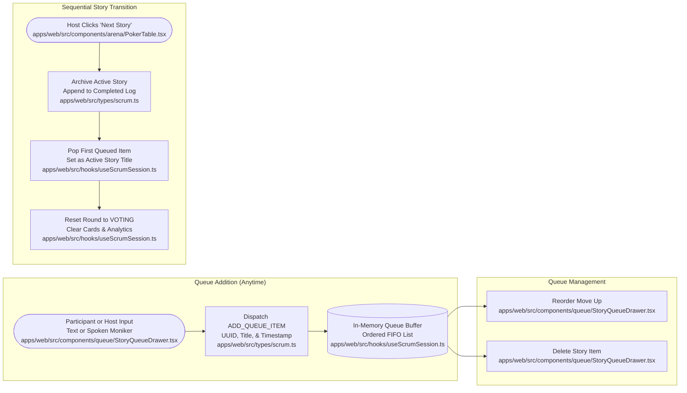
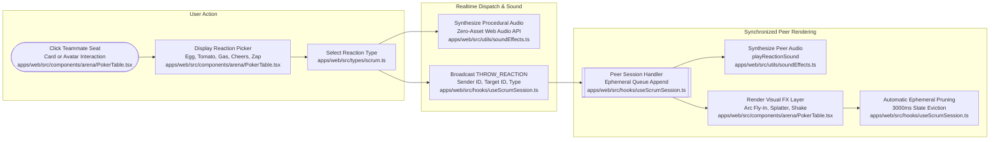

# System Architecture: BlindScrum

This document outlines the architecture, real-time protocols, state machine transitions, and data pipelines for BlindScrum.

---

## 1. System Overview

BlindScrum runs as a client-side real-time application with no database. State syncs directly between peers using WebRTC DataChannels orchestrated by Trystero (with public Nostr relay signaling and STUN), with a local browser BroadcastChannel fallback for multi-tab testing on the same machine.

---

## 2. Estimation State Machine

The estimation cycle hides individual vote values during the voting phase to prevent anchoring. Card numbers stay on the voter's machine until the host triggers the reveal.

```mermaid
flowchart LR
    subgraph Phase1["Phase 1: Setup & Input"]
        IdleState(["IDLE / READY State<br/>Room active, cards open<br/>apps/web/src/types/scrum.ts"])
        HostInput["Host Sets Story Title<br/>Via typing or microphone<br/>apps/web/src/components/arena/StoryPipeline.tsx"]
        AsyncQueue["Teammates Queue Stories<br/>Pipeline & Drawer Additions<br/>apps/web/src/components/arena/StoryPipeline.tsx"]
    end

    subgraph Phase2["Phase 2: Blind Estimation"]
        VotingState(["VOTING State<br/>Cards displayed face-down<br/>apps/web/src/components/arena/PokerTable.tsx"])
        LocalHold[("Client-Local Memory<br/>Numerical vote value hidden<br/>apps/web/src/hooks/useScrumSession.ts")]
        WireToken["Broadcast Masked Token<br/>CAST_BLIND_VOTE: hasVoted=true<br/>Network Payload Masked"]
    end

    subgraph Phase3["Phase 3: Synchronized Reveal"]
        RevealTrigger{{"Host Clicks Reveal?<br/>apps/web/src/components/arena/PokerTable.tsx"}}
        RevealedState(["REVEALED State<br/>Synchronized 3D Card Flip<br/>apps/web/src/components/arena/PokerTable.tsx"])
        AnalyticsCompute["Compute Consensus Metrics<br/>Average, Mode, & Spread<br/>apps/web/src/utils/analytics.ts"]
        ConsensusGate{{"Consensus >= 70%?<br/>apps/web/src/utils/analytics.ts"}}
        Celebration["Audio Chime & Confetti<br/>playConsensusSound & canvas-confetti<br/>apps/web/src/hooks/useScrumSession.ts"]
    end

    IdleState --> HostInput
    HostInput --> VotingState
    AsyncQueue -.-> IdleState

    VotingState --> LocalHold
    LocalHold --> WireToken
    WireToken --> RevealTrigger

    RevealTrigger -- Yes --> RevealedState
    RevealedState --> AnalyticsCompute
    AnalyticsCompute --> ConsensusGate

    ConsensusGate -- Consensus Met --> Celebration
    ConsensusGate -- Divergence --> RevealedState

    RevealedState -->|Host Clicks Revote| VotingState
    RevealedState -->|Host Clicks Next Story| IdleState
```

---

## 3. Real-Time Voting Sequence

---

## 4. Voice Input Pipeline

---

## 5. Story Queue Transitions

---

## 6. Real-Time Table Reactions & Micro-Interactions Pipeline

