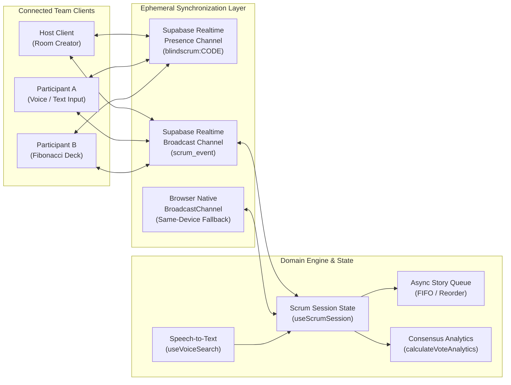
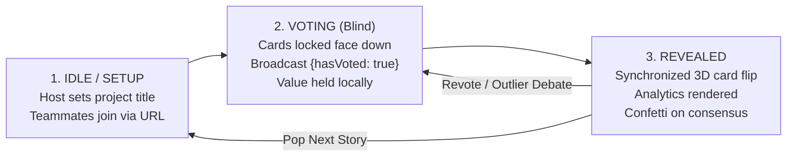
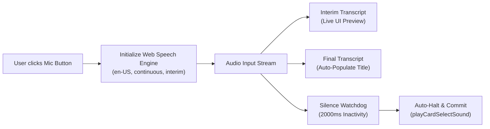
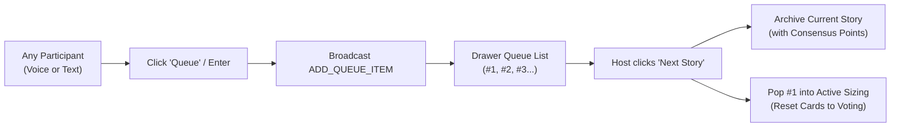

# BlindScrum: Technical Architecture & System Design

This document details the high-fidelity system design, real-time protocols, state machines, and data flow pipelines that power **BlindScrum**.

---

## 1. High-Level System Architecture

BlindScrum operates as an ephemeral real-time client application with zero persistent storage requirements. State is synchronized across peers using WebSocket presence and broadcast clusters with a multi-tab BroadcastChannel failover.

---

## 2. Ephemeral Estimation Lifecycle State Machine

The core estimation workflow enforces cognitive neutrality through a strict 3-phase state machine:

### Stage Details:
1. **Setup / Story Input:**
   - Host types or speaks a story title via the microphone button (`useVoiceSearch`).
   - Teammates can asynchronously append upcoming items into the story queue drawer at any time.
2. **Blind Voting:**
   - Voters tap their card from the Fibonacci sequence (`1, 2, 3, 5, 8, 13, 20, ?, ☕`).
   - The selected number is stored in local client memory.
   - Only a masked token `{ participantId, hasVoted: true }` is transmitted across the wire to avoid network inspection leaks.
3. **Reveal & Analytics:**
   - Host clicks **"Reveal Votes"**.
   - Host transmits the revealed vote mapping across the broadcast channel.
   - All client tables execute a synchronized 3D card flip.
   - The analytics engine computes arithmetic mean, mode (majority choice), and divergence spread, rendering the distribution bar chart.

---

## 3. Voice-to-Text Story Input Pipeline

Speech recognition leverages the browser-native W3C `SpeechRecognition` API adapted from `kxnghans.github.io`:

---

## 4. Asynchronous Story Queue Architecture

The asynchronous queue enables continuous sprint sizing without interrupting current discussions:

---

## 5. Security & Boundary Guardrails

1. **Zero Persistence:**
   - No database queries (`SELECT`/`INSERT`) are executed.
   - No cookies, tokens, or PII are persisted on the server or edge worker.
2. **True Blind Protection:**
   - Voting values remain isolated on the client until the reveal broadcast, eliminating inspectable JSON payload leaks during active voting.
3. **Input Sanitization:**
   - Story titles and monikers are trimmed, bounded to safe lengths, and rendered using React DOM escaping to prevent XSS.
